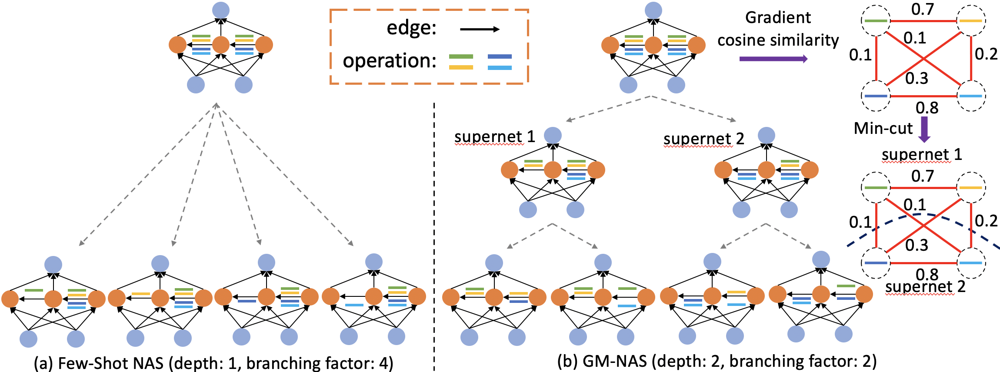

# GM-NAS

This repository contains the PyTorch implementation of the paper **Generalizing Few-Shot NAS with Gradient Matching**, ICLR 2022.

By Shoukang Hu*, Ruochen Wang*, Lanqing Hong, Zhenguo Li, Cho-Jui Hsieh, Jiashi Feng.

[Paper-arxiv](https://openreview.net/pdf?id=_jMtny3sMKU)

    

#### For experiments on NASBench-201 and DARTS space, please refer to WS-GM/README.md

#### For experiments on ProxylessNAS space, please refer to ProxylessNAS-GM/README.md

#### For experiments on OFA space, please refer to once-for-all-GM/README.md

#### For evaluating searched architectures from ProxylessNAS and OFA space, please refer to Imagenet_train/README.md

### Citation
If you find our codes or trained models useful in your research, please consider to star our repo and cite our paper:

    @inproceedings{hu2021generalizing,
      title={Generalizing Few-Shot NAS with Gradient Matching},
      author={Hu, Shoukang and Wang, Ruochen and Lanqing, HONG and Li, Zhenguo and Hsieh, Cho-Jui and Feng, Jiashi},
      booktitle={International Conference on Learning Representations},
      year={2021}
    }

